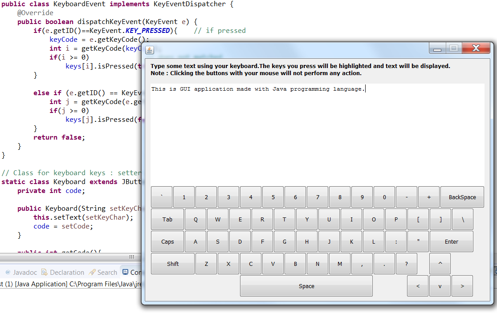

# My_JavaCode

1. Typing Tutor
* Typing quickly and correctly is an essential skill for working effectively with computers and the Internet. In this exercise you will build a GUI application that can help users learn to “touch type” (i.e. type correctly without looking at the keyboard). The application should display a virtual keyboard and should allow the user to watch what he or she is typing on the screen without looking at the actual keyboard. Use JButtons to represent the keys. As the user presses each key, the application highlights the corresponding JButton on the GUI and adds the character to a JTextArea that shows what the user has typed so far. [Hint: To highlight a JButton, use its SetBackground method to change its background colour. When the key is released, reset its original background colour. You can obtain the JButton’s original background colour with the getbackground method before you change its colour.]

Expected output...

2. Comming soon
