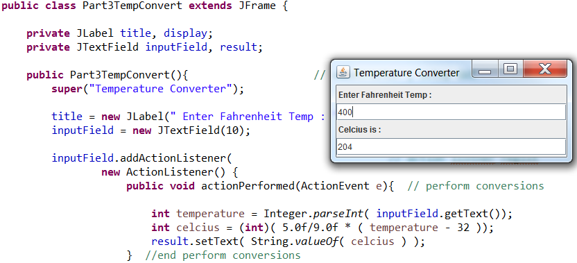
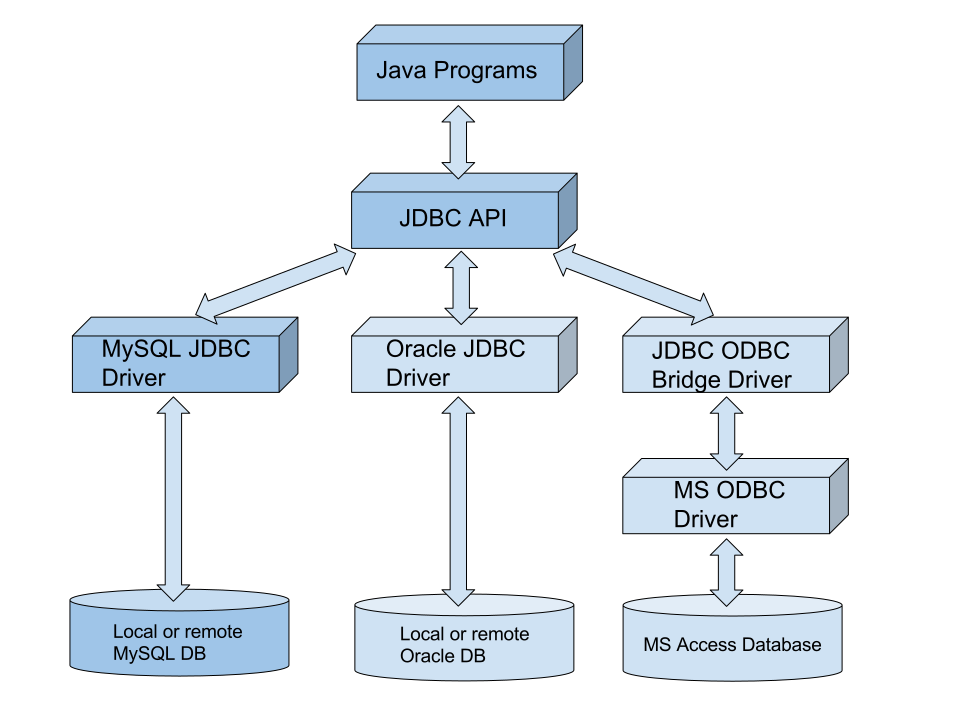

### My_JavaCode

1. Typing Tutor

- Typing quickly and correctly is an essential skill for working effectively with computers and the Internet. I built a GUI application that can help users learn to “touch type” (i.e. type correctly without looking at the keyboard). The application display a virtual keyboard and allow the user to watch what he or she is typing on the screen without looking at the actual keyboard. Used JButtons to represent the keys. As the user presses each key, the application highlights the corresponding JButton on the GUI and adds the character to a JTextArea that shows what the user has typed so far. 

- Expected output...

2. Temperature conversion app

- Convert from Fahrenheit to Cesius.  User input from the keyboard(via a JTextField)

- Expected output...

3. Java program diagram

4. Comming soon
* 

